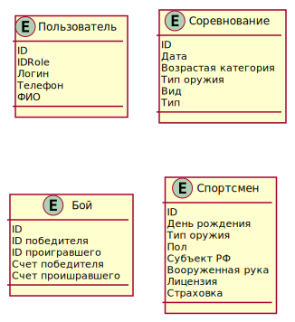

# MyFensing

## Краткое описание идеи проекта

Идея заключается в разработке ПО, которое позволит спортсменам эффективнее отслеживать и анализировать результаты соревнований по фехтованию. ПО должно предоставлять функционал как для спортсменов, так и для тренеров и судей. **Для спортсменов** ПО должно предоставлять расписание ближайших соревнований, на которые они либо подали заявку, либо могут ее подать), а также результаты предыдущих турниров. **Для тренеров** должна быть предоставлена информация о своих подопечных + расписание ближайших соречнований. **Для судей** должна быть предоставлена информация о ближайших соревнованиях, а также предоставлена возможность отправлять результаты прошедших соревнований.

## Краткое описание предметной области

Предметная область включает в себя:

* пользователи системы (администратор, спортсмен, тренер, судья)
* соревнования
* протокол соревнования (результаты)

## Краткий анализ аналогичных решений по 3 критериям

|Проект \ Критерий|Предоставление информации о каждом спортсмене|Календарь соревнований| Результаты соревнований|Наличие авторизации|
|---|---|---|---|---|
|Федерация фехтования|+|+|+|-|
|En Garde|-|+|+|-|

## Краткое обоснование целесообразности и актуальности проекта

MyFencing позволит спортсменам и их тренерам эффективнее отслеживать личный прогресс каждого спортсмена, а также упростит поиск ближайших соревнований.

## Use-Case - диаграмма

<!--  -->

## ER-диаграмма сущностей

## Архитектурные характеристики, важные для проекта

* База данных - реляционная;
* Язык реализации - Golang;
* Приложенее - сетевое, web-приложение, предоставляющее API для любых платформ, использующих протокол HTTP;

# ЛР2

## Описание типа приложения и выбранного технологического стека

* СУБД - PostgreSQL;
* Язык реализации - Golang;
* Приложенее - сетевое, web-приложение;

## Верхнеуровневое разбиение на компоненты

## UML диаграмма классов для компонента доступа к данным

## UML диаграмма классов для компонента с бизнес-логикой

## UML диаграммы "модельных" классов сущностей

### Сущности базы данных

### Сущности системы

### Транспортные сущности

Будет спроектирована в дальнейших лабораторных.
